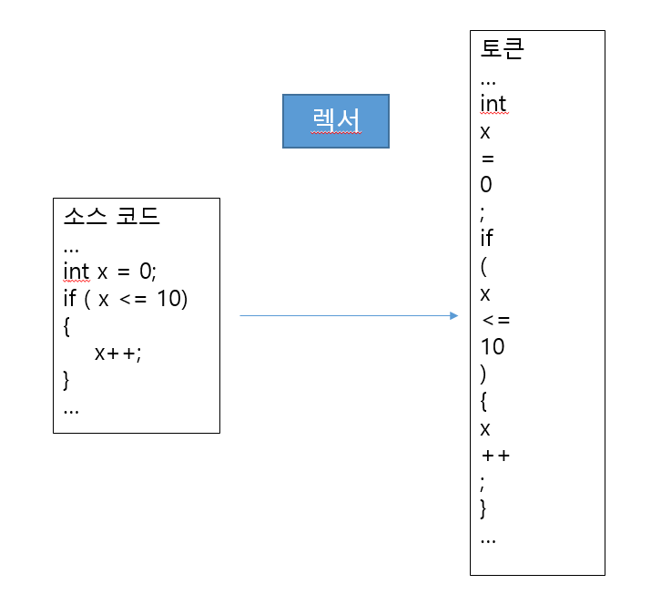
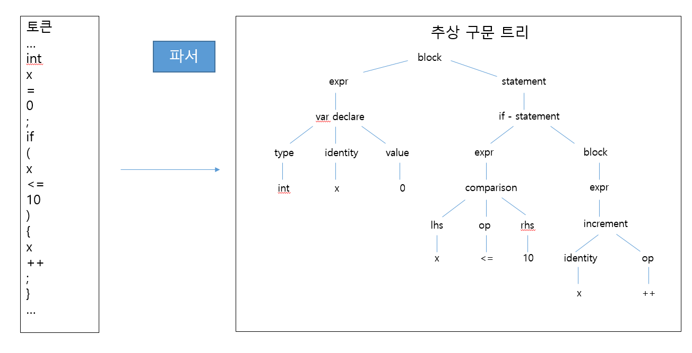
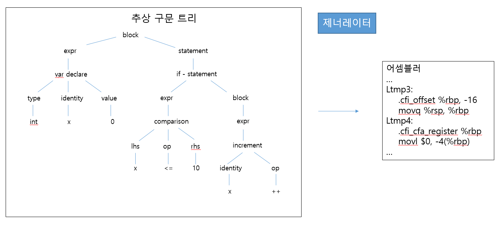
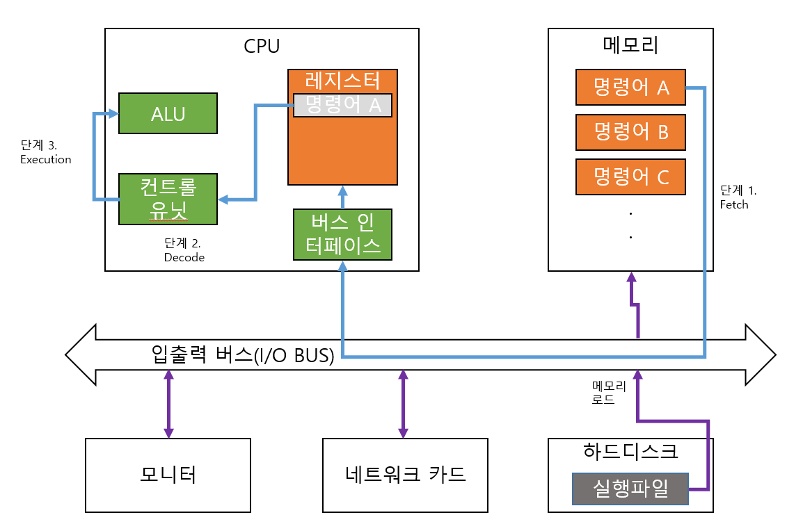

# 컴파일러와 인터프리터 차이

컴파일 언어와 인터프리트 언어의 가장 큰 차이점은 컴파일 시점 이다.

**컴파일 언어** : 런타임 전에 컴파일을 한다.

**인터프리트 언어** : 런타임 중에 컴파일을 한다.

<br/><br/>

# 컴파일타임과 런타임

**컴파일타임** - C언어 코드가 컴파일러를 통해 기계어로 변환되어 목적 파일 또는 실행 파일이 나오는 이전까지 과정

**런타임** - 실행 파일을 실행한 이후부터 과정 (메인 메모리에 올라가고 등등...)

<br/><br/>

# 컴파일

C언어 코드가 컴파일러를 통해 기계어로 변환되어 목적 파일 또는 실행 파일이 생성

## 컴파일러 종류

    GNU 컴파일러, 어셈블러, 링커, 라이브러리 : gcc, cpp0, cc1, as, collect2(ld)
    MSVC 컴파일러, 어셈블러, 링커, 라이브러리 : cl.exe, ml.exe, link.exe, lib.exe

## 컴파일러 과정

**1. 소스코드 : main.c**

컴파일언어인 C언어 소스코드를 작성

```c
$ cat main.c

#include <stdio.h>

#define HELLO "hello_world"

int main()
{
        int i=123;
        printf("%d\n", i);
        printf("%s\n", HELLO);
        return 0;
}
```
**2. 전처리 과정 : gcc -E main.c -o main.i -> main.i (전처리 파일 생성)**

전처리 지시자(예: #include, #define 등...)가 있다면 전처리기에 의해 치환된다.

    $ /usr/lib/gcc/x86_64-linux-gnu/7/cc1 -E -quiet -v -imultiarch x86_64-linux-gnu main.c -mtune=generic -march=x86-64 -fpch-preprocess -fstack-protector-strong -Wformat -Wformat-security -o main.i    

```c
$ cat main.i

int main()
{
 int i=123;
 printf("%d\n", i);
 printf("%s\n", "hello_world");
 return 0;
}
```

**3. 컴파일 과정 : gcc -S main.i -> main.s (어셈블리어 파일 생성)**

컴파일러는 고급 언어(C언어)를 저급 언어(어셈블러)로 변환

컴파일러 안에는 렉서, 파서, 제너레이터가 포함되어있다.

렉서 : 소스코드를 토큰 단위로 나뉘어 파서로 보낸다.


파서 : 언어의 문법을 나타내는 패턴을 파악하여 소스코드를 AST(Abstract Syntax Tree - 추상 구문 트리)로 변환한다.


제너레이터 : AST를 목표 언어의 문법(어셈블러)으로 변환한다.


    $ /usr/lib/gcc/x86_64-linux-gnu/7/cc1 -fpreprocessed main.i -quiet -dumpbase main.c -mtune=generic -march=x86-64 -auxbase main -version -fstack-protector-strong -Wformat -Wformat-security -o main.s

```c
$ cat main.s

        .file   "main.c"
        .text
        .section        .rodata
.LC0:
        .string "%d\n"
.LC1:
        .string "hello_world"
        .text
        .globl  main
        .type   main, @function
main:
.LFB0:
        .cfi_startproc
        pushq   %rbp
        .cfi_def_cfa_offset 16
        
(...생략)
```


**4. 어셈블 과정 : as main.s -o main.o -> main.o (오브젝트 파일 생성)**

CPU가 해석할수있도록 기계어로 변환한다.
기계어(이진, 바이너리) 이기때문에 사람은 알아볼수없다.

    $ as -v --64 main.s -o main.o

```c
$ cat main.o

ELF>8@@
UH��H���E�{�E���H�=��H�=����%d
hello_worldGCC: (Ubuntu 7.5.0-3ubuntu1~18.04) 7.5.0zRx
s                                                         �8A�C
#*main.cmain_GLOBAL_OFFSET_TABLE_printfputs��������!
                                                          ��������(-
                                                                      �������� .symtab.strtab.shstrtab.rela.text.data.bss.rodata.comment.note.GNU-stack.rela.eh_frame @8@X`
&xx1x90�*B�W�R@�
�8
```

```c
objdump 명령어를 통해 디스어셈블 할수있다.
$ objdump -d main.o

main.o:     file format elf64-x86-64

Disassembly of section .text:

0000000000000000 <main>:
   0:	55                   	push   %rbp
   1:	48 89 e5             	mov    %rsp,%rbp
   4:	48 83 ec 10          	sub    $0x10,%rsp
   8:	c7 45 fc 7b 00 00 00 	movl   $0x7b,-0x4(%rbp)
   f:	8b 45 fc             	mov    -0x4(%rbp),%eax
  12:	89 c6                	mov    %eax,%esi
  14:	48 8d 3d 00 00 00 00 	lea    0x0(%rip),%rdi        # 1b <main+0x1b>
  1b:	b8 00 00 00 00       	mov    $0x0,%eax
  20:	e8 00 00 00 00       	callq  25 <main+0x25>
  25:	48 8d 3d 00 00 00 00 	lea    0x0(%rip),%rdi        # 2c <main+0x2c>
  2c:	e8 00 00 00 00       	callq  31 <main+0x31>
  31:	b8 00 00 00 00       	mov    $0x0,%eax
  36:	c9                   	leaveq 
  37:	c3                   	retq 
```

**5. 링크 과정 : ld main.o -o main -> main (실행파일 생성)**
    
리눅스에서 실행가능하도록 생성한 오브젝트 파일과 리눅스 라이브러리를 결합한다.

    $ /usr/lib/gcc/x86_64-linux-gnu/7/collect2 -plugin /usr/lib/gcc/x86_64-linux-gnu/7/liblto_plugin.so -plugin-opt=/usr/lib/gcc/x86_64-linux-gnu/7/lto-wrapper -plugin-opt=-fresolution=main.res -plugin-opt=-pass-through=-lgcc -plugin-opt=-pass-through=-lgcc_s -plugin-opt=-pass-through=-lc -plugin-opt=-pass-through=-lgcc -plugin-opt=-pass-through=-lgcc_s --build-id --eh-frame-hdr -m elf_x86_64 --hash-style=gnu --as-needed -dynamic-linker /lib64/ld-linux-x86-64.so.2 -pie -z now -z relro -o main /usr/lib/gcc/x86_64-linux-gnu/7/../../../x86_64-linux-gnu/Scrt1.o /usr/lib/gcc/x86_64-linux-gnu/7/../../../x86_64-linux-gnu/crti.o /usr/lib/gcc/x86_64-linux-gnu/7/crtbeginS.o -L/usr/lib/gcc/x86_64-linux-gnu/7 -L/usr/lib/gcc/x86_64-linux-gnu/7/../../../x86_64-linux-gnu -L/usr/lib/gcc/x86_64-linux-gnu/7/../../../../lib -L/lib/x86_64-linux-gnu -L/lib/../lib -L/usr/lib/x86_64-linux-gnu -L/usr/lib/../lib -L/usr/lib/gcc/x86_64-linux-gnu/7/../../.. main.o -lgcc --push-state --as-needed -lgcc_s --pop-state -lc -lgcc --push-state --as-needed -lgcc_s --pop-state /usr/lib/gcc/x86_64-linux-gnu/7/crtendS.o /usr/lib/gcc/x86_64-linux-gnu/7/../../../x86_64-linux-gnu/crtn.o

<br/>
    
    $ ./main
    123
    hello_world


<br/>

### gcc의 save-temps옵션을 통해 어떻게 컴파일되는지 세부적으로 알수있다.

**$ gcc -v --save-temps -o main main.c**


<br/>

### 런 타임

    1. 실행파일을 실행하고 나서 런 타임 시작
    2. 실행파일을 실행하면 메모리[heap, stack, data, code]에 로드
    3. 명령어 A가 메모리에서 레지스터로 이동 [Fetch]
    4. 컨트롤 유닛은 레지스터에 도착한 명령어 A를 해석 [Decode]
    5. 컨트롤 유닛이 해석이 끝난 명령어 A를 ALU에 연산시킴 [Execution]

    


<br/>
<br/>

    컴파일언어는 CPU가 바로 해석 가능  -> 속도빠름 (그냥 실행 가능, CPU와 OS 의존적)

    인터프리터 언어는 인터프리터가 있어야 CPU가 해석 가능 -> 속도 느림 (python 인터프리터나 java 인터프리터가 있어야 실행 가능, CPU와 OS 비의존적)

# 다음 시간에

## 인터프리트

    파이썬 코드를 실행하면 바로 런타임이 시작
    실시간으로 컴파일되고 렉서, 파서를 거쳐서 바이트코드 생성
    바이코드는 파이썬 가상머신 위에서 돌아가기


## 바이너리코드와 바이트 코드의 차이

## CPU 수행과정 
fetch decode store load