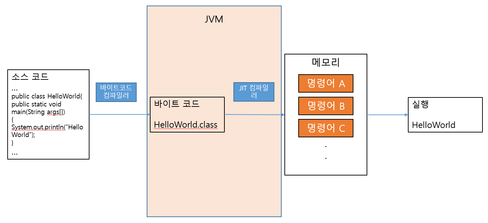

# 자바

**1. 소스코드 : HelloWorld.java**

자바언어 소스코드를 작성

```java
$ cat HelloWorld.java

public class HelloWorld{
	public static void main(String args[]){
		System.out.println("Hello World");
	}
}
```

**2. 컴파일 과정 : javac HelloWorld.java -> HelloWorld.class (class 파일 생성)**

자바 바이트코드 컴파일러를 사용하여 소스코드를 컴파일한다.

HelloWorld.class -> 자바 바이트 코드

자바 가상 머신이 이해할 수 있는 0과 1로 구성된 이진코드를 의미.

```java
$ cat HelloWorld.class
����4
	
<init>()VCodeLineNumberTablemain([Ljava/lang/String;)V
SourceFileHelloWorld.java
                         
                          
                             Hello World
                                         
HelloWorldjava/lang/Objectjava/lang/SystemoutLjava/io/PrintStream;java/io/PrintStreamprintln(Ljava/lang/String;)V!	*��
	

        	%	���
```

**3. 실행 과정 : java HelloWorld**

자바 JIT(JUST-IN-TIME) 컴파일러(인터프리터와 컴파일러를 혼합)를 사용하여 바이트코드를 읽어 각 운영체제에 맞는 기계어로 번역하고 자바 가상 머신 위에서 실행한다.

JIT(JUST-IN-TIME) 컴파일러 : 번역된 코드를 캐싱해둔 다음 똑같은 코드가 있다면 번역하지않고 캐싱해둔 값을 사용하여 매번 기계어 코드가 생성되는 것을 방지해 인터프리팅 시간을 단축시킨다. 인터프리터와 컴파일러의 방식을 적절히 혼합해서 속도를 개선

```java
$ java HelloWorld

Hello World
```

**4. 컴파일 과정**



</br></br>

# 파이썬

**1. 소스코드 : hello_world.py**

자바언어 소스코드를 작성

```python
$ cat hello_world.py

import os
print("hello_world")

```

**2. 인터프리터 : python3 hello_world.py -> hello_world.pyc (pyc 파일 생성) -> 실행**

파이썬 인터프리터가 실시간으로 소스코드를 컴파일하여 파이썬 바이트 코드를 생성하고

생성된 바이트 코드를 읽어 각 운영체제에 맞는 기계어로 번역하고 파이썬 가상 머신 위에서 실행한다.

```python
$ cat hello_world.pyc
����4
	
<init>()VCodeLineNumberTablemain([Ljava/lang/String;)V
SourceFilehello_world.py
                         
                          
                             hello world
                                         
HelloWorldjava/lang/Objectjava/lang/SystemoutLjava/io/PrintStream;java/io/PrintStreamprintln(Ljava/lang/String;)V!	*��
	

        	%	���
```

```python
$ python3 hello_world.py

hello_world

```

**3. 인터프리터 과정**


</br></br>

# 바이너리코드와 바이트 코드의 차이
CPU가 이해할 수 있는 언어가 바이너리 코드라면 바이트 코드는 가상 머신이 이해할 수 언어이다.

CPU가 아닌 가상 머신에서 이해할 수 있는 코드를 위한 이진 표현법이다. 즉, 가상 머신이 이해할 수 있는 0과 1로 구성된 이진코드를 의미.

어떤 플렛폼에도 종속되지 않고 실행될 수 있는 가상 머신용 기계어 코드이다.

고급언어로 작성된 소스코드를 가상 머신이 이해할 수 있는 중간 코드로 컴파일한 것을 말한다.

바이트 코드는 다시 실시간 번역기 또는 저스트 인 타임(just-in-time, JIT) 컴파일러에 의해 바이너리 코드로 변환된다.

CPU가 텍스트를 이해하지 못하듯이 가상 머신 또한 텍스트를 이해하지 못한다.

</br></br>
