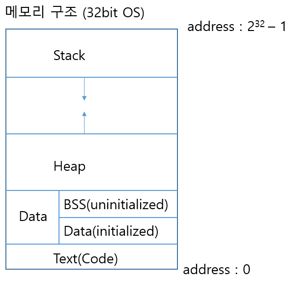

# 메모리 구조

<figure>
 
</figure>

asdf
32bit OS에서 ram 4GB 이상 사용할수없다. 그 이유는 232 가 4GB이기 때문이다.

하나의 명령어 OPCODE 크기가 32bit이므로 한번에 송수신 가능한 데이터 크기가 32bit이다.

32bit에서 포인터 크기는 32bit, 64bit에서 포인터 크기는 64bit이다.

입출력 버스와 버스 인터페이스 크기 또한 32bit이다.

텍스트(code) 영역

메모리의 코드(code) 영역은 실행할 프로그램의 코드가 저장되는 영역으로 텍스트(code) 영역(함수명, if, while, switch 등...)

CPU는 코드 영역에 저장된 명령어를 하나씩 가져가서 처리하게 됩니다.

데이터(data) 영역

메모리의 데이터(data) 영역은 프로그램의 전역 변수와 정적(static) 변수가 저장되는 영역

데이터 영역은 프로그램의 시작과 함께 할당되며, 프로그램이 종료되면 소멸.

BSS 영역은 초기화되지 않은 전역 변수가 저장되고, Data 영역은 초기화된 전역 변수가 저장된다.

스택(stack) 영역

메모리의 스택(stack) 영역은 함수의 호출과 관계되는 지역 변수와 매개변수가 저장되는 영역

스택 영역은 함수의 호출과 함께 할당되며, 함수의 호출이 완료되면 소멸

스택 영역에 저장되는 함수의 호출 정보는 스택 프레임(stack frame)

LIFO, Last-In First-Out 방식

스택 영역은 메모리의 높은 주소에서 낮은 주소의 방향으로 할당

힙(heap) 영역

메모리의 힙 영역은 사용자가 직접 관리할 수 있는 메모리 영역

힙 영역은 사용자에 의해 메모리 공간이 동적으로 할당되고 해제

힙 영역은 메모리의 낮은 주소에서 높은 주소의 방향으로 할당
